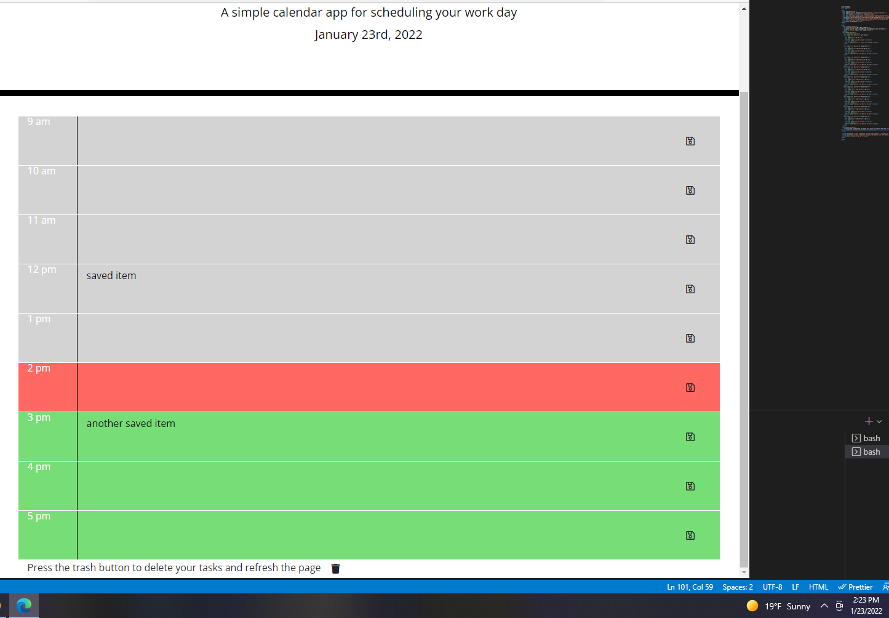

# hw5

## description

This project is a daily project scheduler that allows users to save events for each hour of the work day using Moment and Jquery. Saved items are saved to local storage and will load on startup, and all items can be cleared using a reset button. The app is coded to have the color coding adjust based on what time of day it currently is.

## screenshots

## links

\* Here is the link to the repo [jasonburke/repo] (https://github.com/Jasonsburke90/hw5)
\*Here is the link to the pages: [jasonburke/pages] (https://jasonsburke90.github.io/hw5/)
